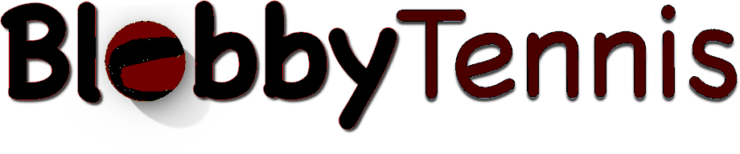

# Blobbier Tennis

Automated modding for Blobby Tennis by Slin

Copy and modify `configs/example` and run `modder.py` to generate a mod for each config.

## Prerequisites

- [Python](https://www.python.org/) 3.12 or above
- See [APK-Modding-Guide](https://github.com/twhlynch/APK-Modding-Guide) for apktool, zipalign, and apksigner.

If you want to use .png files instead of .astc files, get the [astc encoder](https://github.com/ARM-software/astc-encoder/releases). Unzip the version for your OS, and move `/bin` into this folder's `res` folder.

If you want to use audio files other than .ogg, install [ffmpeg](https://www.ffmpeg.org/download.html) from its website or with your package manager (check if its installed first by running `ffmpeg` in terminal) 

> Make sure they are added to PATH

## Usage

Setup the configs to be whatever you want. Make sure any assets such as textures are in `/configs/NAME`.

`res/resources.zip` contains files from Blobby Tennis, modify these to get dimensions and scale correct.

- Audio should be converted to .ogg format
- Textures (except title) must be converted to .astc format
- Models must be converted to .sgm format. (Get the SGM BlenderExport plugin from [here](https://github.com/uberpixel/SGM-file-format), and add `BlenderExport/VERSIONx/io_export_sgm.py` to blender using the instructions [here](https://docs.blender.org/manual/en/latest/editors/preferences/addons.html).)
- The folder name is only alphanumeric and underscores
- font must be .ttf
- all images dimensions should be kept the same
- leave options blank ("") or remove the line, to ignore them. name, and assets however are required

Run `python3 -m venv .` to initialize a python virtual environment

Run `bin/python modder.py`